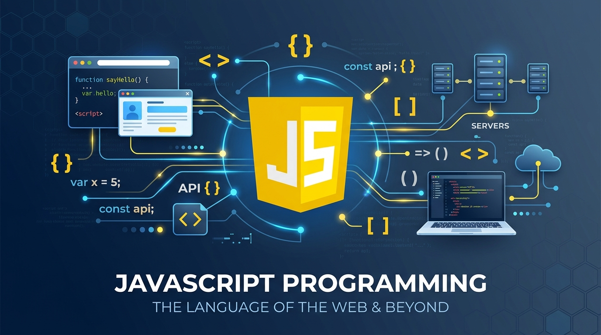

# JavaScript Knowledge Bundle

This repository is a small OKF 0.2-style knowledge bundle for JavaScript learning and testing with obviewus.

## Bundle intent

- Build a practical JavaScript concept graph from fundamentals through async patterns.
- Keep each concept in a markdown document with YAML frontmatter for import.
- Exclude `index.md` and `log.md` from concept import so the bundle remains machine-readable.

## OKF 0.2 shape

Each concept file uses frontmatter fields like:

- `id`
- `title`
- `type`
- `description`
- `status`
- `trust`
- `stale`
- `tags`

The bundle index is also a markdown document with metadata describing the bundle itself.

## How to use this knowledge bundle

There are two ways to learn JavaScript from this bundle:

1. **Browse it manually.** Start at [index.md](index.md) and follow the numbered sections in order — each section's own `index.md` links out to the concept files, in the order they build on each other.
2. **Point your LLM at it.** Open this repository in an AI-assisted IDE (VS Code, Antigravity, Cursor, or similar) and ask your assistant questions grounded in these files — e.g. "explain closures using the concepts in this bundle" or "quiz me on operators." The bundle's structured frontmatter and cross-linked concepts are designed to give an LLM accurate, scoped context to teach from.

## Acknowledgments

This bundle was written using  [VS Code](https://code.visualstudio.com/) and  [Antigravity](https://antigravity.google/), with the help of  [Claude Code](https://claude.com/claude-code) and Gemini 3.8 Flash — thank you to both for their assistance drafting and organizing this content.
