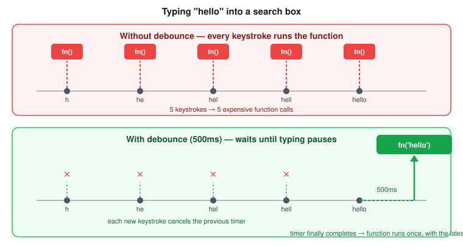

# Debouncing

Debouncing is a technique that says: "wait until things go quiet, then do the work — just once." It's one of the first genuinely practical patterns beginners meet after learning closures and `setTimeout`, and it shows up constantly in real front-end code.

## The problem debouncing solves

Some browser events fire *a lot*, much more often than you'd want to react to them: typing in a search box fires `keyup` on every keystroke, and dragging a window fires `resize` dozens of times a second.

Imagine a search box that calls an API every time the user types a character:

```js
function search(query) {
  console.log('Searching for:', query);
  // imagine this sends a network request
}

input.addEventListener('keyup', (event) => {
  search(event.target.value);
});
```

If a user quickly types `"hello"`, this fires `search` five times — once for `"h"`, `"he"`, `"hel"`, `"hell"`, and finally `"hello"` — even though only that last, complete word is actually useful. Four of those five network requests were wasted work.



*Original diagram created for this bundle.*

## What debouncing actually does

A **debounced** function waits for a specified delay after it was *last* called before it actually runs. If it gets called again before that delay is up, the wait starts over. The function only ever runs once the calls stop coming in for the full delay — using the arguments from that final call.

Think of it like a lobby elevator: it doesn't leave the moment someone steps in. It waits a few seconds in case someone else is coming — and if someone does step in, the wait starts over from zero.

## Building `debounce` step by step

### Step 1: a broken first attempt

A natural first guess is to just wrap the call in `setTimeout`:

```js
function debounceBroken(fn, delay) {
  setTimeout(() => fn(), delay);
}
```

This doesn't work: every call schedules its *own* independent timer, and none of the earlier ones are ever cancelled. Calling this five times still runs `fn` five times — just each one delayed a bit.

### Step 2: remember the timer, and cancel it

The fix is to keep track of the pending timer, and clear it every time the debounced function is called again:

```js
function debounce(fn, delay) {
  let timeoutId; // remembered between calls thanks to the closure

  return function (...args) {
    clearTimeout(timeoutId);          // cancel the previous pending call, if any
    timeoutId = setTimeout(() => {
      fn.apply(this, args);           // finally run the real function
    }, delay);
  };
}
```

Walking through what each line does:

- `debounce` takes the real function (`fn`) and a `delay` in milliseconds, and returns a **new** function.
- That returned function is what you actually attach as the event handler — never the original `fn` directly.
- `timeoutId` lives in the closure, so it survives between calls instead of resetting every time.
- Every time the returned function runs, it first cancels whatever timer was still pending (`clearTimeout`), then starts a fresh one.
- Only when a full `delay` passes *without* another call does the `setTimeout` callback finally fire and run `fn`.
- [`fn.apply(this, args)`](./call-apply-bind.md) forwards both the correct `this` and the arguments the debounced function was last called with.

### Step 3: use it

```js
const debouncedSearch = debounce(search, 500);

input.addEventListener('keyup', (event) => {
  debouncedSearch(event.target.value);
});
```

Now typing `"hello"` quickly calls `search` **once** — 500ms after the last keystroke, with `"hello"` as the argument. Every keystroke before that just resets the clock.

## Other common uses

- **Search-as-you-type boxes** — wait for the user to stop typing before calling the API.
- **Window resize handlers** — wait until the user finishes resizing before recalculating an expensive layout.
- **Autosave** — save a document a moment after the user stops editing, not on every keystroke.

## Debounce vs. throttle

These two are easy to mix up:

- **Debounce** waits for a *pause* — it only runs after calls stop coming in for the full delay. Great when you only care about the final state (e.g. the final search text).
- **Throttle** guarantees a run at most once every fixed interval, *regardless* of whether calls keep coming in. Great when you need steady, ongoing updates (e.g. a scroll position tracker) rather than a single result at the end.

## Related concepts

- [call, apply, and bind](./call-apply-bind.md)
- [Function declarations and expressions](../functions/functions.md)
- [Async JavaScript](./async.md)
