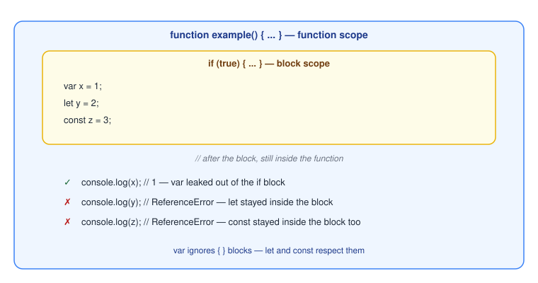

# Variable Declaration: `var`, `let`, and `const`

JavaScript gives you three keywords for declaring a variable: `var`, `let`, and `const`. They look similar, but differ in three simple ways: whether you can **reassign** them, whether you can **redeclare** them, and where they're **visible** (their scope).

## Quick comparison

| | Can reassign? | Can redeclare? | Scope |
| --- | --- | --- | --- |
| `var` | Yes | Yes | Function |
| `let` | Yes | No | Block |
| `const` | No | No | Block |

## 1. Can you change the value later?

```js
let count = 1;
count = 2; // fine

const total = 1;
total = 2; // TypeError: Assignment to constant variable.
```

[`const`](./constants.md) locks the variable to its initial value; [`let`](./variables.md) and `var` can both be reassigned freely.

## 2. Can you declare it twice?

```js
var name = 'Alice';
var name = 'Bob'; // fine — no error, just overwrites the first one

let age = 25;
let age = 26; // SyntaxError: Identifier 'age' has already been declared
```

`var` silently allows declaring the same name twice in the same scope, which can hide typos and bugs. `let` and `const` both refuse to let you redeclare a name — the mistake surfaces immediately as an error instead of a silent overwrite.

## 3. Where can you use it? (scope)

This is the biggest difference. `var` is **function-scoped** — it ignores `{ }` blocks like `if` and `for`, and "leaks" out to the whole enclosing function. `let` and `const` are **block-scoped** — they only exist inside the nearest pair of curly braces.



*Original diagram created for this bundle.*

```js
function example() {
  if (true) {
    var x = 1;
    let y = 2;
  }

  console.log(x); // 1 — var leaked out of the if block
  console.log(y); // ReferenceError: y is not defined — let stayed inside the block
}
```

This is exactly the kind of bug block scoping was designed to prevent: with `var`, a variable meant to be a temporary detail inside an `if` or a loop is quietly visible everywhere else in the function too.

## Which one should I use?

- **Default to `const`.** It communicates that the value won't be reassigned, and catches accidental reassignment as an error.
- **Use `let`** only when you know the value needs to change later — a loop counter, a running total, anything reassigned as the code runs.
- **Avoid `var`** in new code. Its function scope and silent redeclaration allow bugs that `let`/`const` simply refuse to compile.

## Related concepts

- [Variables](./variables.md)
- [Constants](./constants.md)
- [Hoisting](../functions/hoisting.md)
