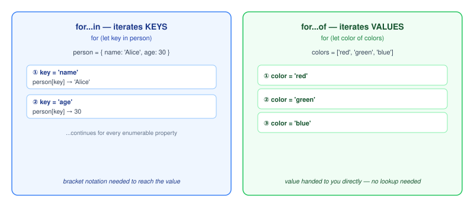

# For...in

The `for...in` loop iterates over all enumerable properties of an object (including inherited properties).

## Syntax

```js
for (let key in object) {
  // statements using key and object[key]
}
```

## Example: Iterating over an object's properties

```js
const person = {
  name: 'Alice',
  age: 30
};

for (let key in person) {
  console.log(key, person[key]);
}
// Output:
// name Alice
// age 30
```

Notice that inside a `for...in` loop, you access property values using bracket notation (`person[key]`) because `key` is a dynamic variable holding the property name as a string.

## `for...in` with Arrays

You can also use `for...in` to iterate over array indices:

```js
const colors = ['red', 'green', 'blue'];

for (let index in colors) {
  console.log(index, colors[index]);
}
// Output:
// 0 red
// 1 green
// 2 blue
```

> [!TIP]
> For arrays, prefer the modern `for...of` loop instead of `for...in`, because `for...of` yields the items directly rather than string indices.



*Original diagram created for this bundle.*

## Related concepts

- [For...of](./for-of.md)
- [Objects](../basics/objects.md)
- [Arrays](../basics/arrays.md)
