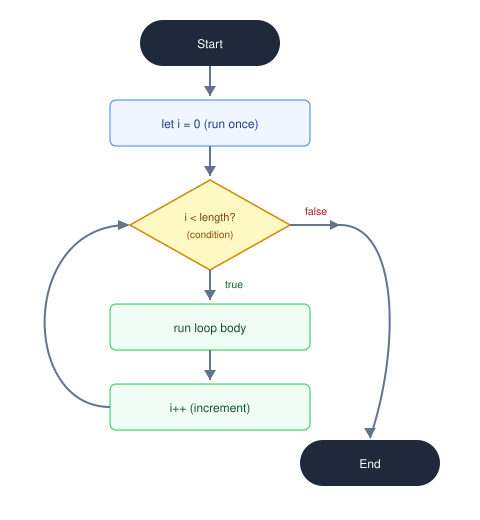

# For loop

Loops allow you to repeat an action or execute a block of code multiple times without repeating the statements manually.

The standard `for` loop is ideal when you know in advance how many times the loop should run.

## Syntax

```js
for (initialExpression; condition; incrementExpression) {
  // statement to execute in each iteration
}
```



- **Initial expression**: Initializes the loop counter variable (e.g. `let i = 0`). Executed once before loop starts.
- **Condition**: Evaluated before each iteration. If `true`, loop executes; if `false`, loop terminates.
- **Increment expression**: Updates the counter after each iteration (e.g. `i++`).

## Example: Printing numbers

```js
for (let i = 0; i < 5; i++) {
  console.log('Hello World', i);
}
```

## Example: Displaying odd numbers in reverse

```js
for (let i = 9; i >= 1; i -= 2) {
  console.log(i); // 9, 7, 5, 3, 1
}
```

## Related concepts

- [While loop](./while.md)
- [Do...while loop](./do-while.md)
- [For...in](./for-in.md)
- [For...of](./for-of.md)
- [Break and continue](./break-and-continue.md)
