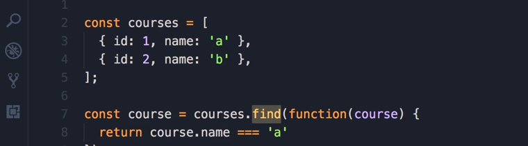
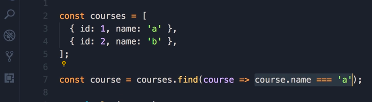

# Arrow Functions

Whenever you pass a function as an argument to another function — a **callback**, such as the predicate `find` uses to test each element — ES6's **arrow function** syntax gives you a shorter, cleaner way to write it.

## From a function expression to an arrow function

Start with an ordinary function expression, passed to `find` to look up a course by name:

```js
const courses = [
  { id: 1, name: 'a' },
  { id: 2, name: 'b' }
];

const course = courses.find(function (course) {
  return course.name === 'a';
});
```



*Screenshot from the course video.*

Rewriting this as an arrow function is a series of small, mechanical steps:

**1. Drop the `function` keyword**, and put a fat arrow (`=>`) between the parameter list and the body:

```js
courses.find((course) => {
  return course.name === 'a';
});
```

**2. Drop the parentheses around a single parameter.** If the arrow function takes exactly one parameter, the parentheses around it are optional (with zero parameters, or more than one, they're required):

```js
courses.find(course => {
  return course.name === 'a';
});
```

**3. Drop `return` and the curly braces, if the body is a single expression.** When the function body is just one expression whose value you want to return, arrow functions can return it *implicitly* — no `return` keyword, no braces:

```js
courses.find(course => course.name === 'a');
```



*Screenshot from the course video.*

That final line reads almost like English: "find, in courses, the course whose name equals `'a'`." Each step above is optional on its own — you can stop at whichever one still reads clearly for a given function.

## Parameter rules at a glance

| Parameters | Parentheses |
| --- | --- |
| None | Required: `() => { ... }` |
| Exactly one | Optional: `course => ...` or `(course) => ...` |
| Two or more | Required: `(a, b) => { ... }` |

## Other things worth knowing

- Arrow functions don't get their own `this` — they use `this` from the scope they were defined in, which is why they're commonly used inside methods and callbacks where losing `this` would otherwise be a problem (see [call, apply, and bind](./call-apply-bind.md)).
- Arrow functions can't be used as constructors — calling one with `new` throws a `TypeError`.

## Related concepts

- [Function declarations and expressions](./functions.md)
- [Types of functions](./function-types.md)
- [Finding Elements (References)](../arrays/finding-elements-references.md)
- [Iterating Elements](../arrays/iterating-elements.md)
