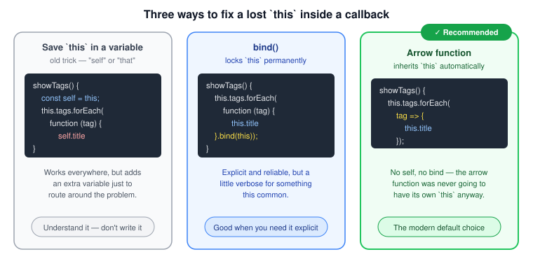

# Changing the Value of `this`

[The `this` keyword](./this-keyword.md) is decided by *how* a function is called, not where it's written. That's mostly a good thing — until it isn't. The [callback trap](./this-keyword.md#the-callback-trap) is the classic example: a function nested inside a method is still just a plain function to JavaScript, so `this` inside it quietly becomes the global object instead of the object you meant.

This page walks through the three ways developers fix that — in the order JavaScript actually gained them, from an old workaround to the modern default.



*Original diagram created for this bundle.*

## The problem, as a reminder

```js
const video = {
  title: 'a',
  tags: ['a', 'b', 'c'],
  showTags() {
    this.tags.forEach(function (tag) {
      console.log(this.title, tag); // this is the global object here — this.title is undefined
    });
  }
};

video.showTags();
```

Inside `showTags`, `this` is `video`, exactly as expected. But the function handed to `forEach` is called by `forEach` itself, as a plain function — so by the ordinary `this` rule, `this` inside it is the global object, not `video`.

## Solution 1 (the old trick): save `this` in a variable

Before `showTags` calls `forEach`, `this` is still `video`. So: save it in an ordinary variable — commonly named `self` or `that` — *before* the nested function runs, and read from that variable instead of `this` inside it:

```js
showTags() {
  const self = this; // self = video, captured while this still means video

  this.tags.forEach(function (tag) {
    console.log(self.title, tag); // self is unaffected by how this callback gets called
  });
}
```

This works because `self` is a completely normal variable — unlike `this`, its value doesn't depend on how a function is called. It just remembers whatever `this` was pointing to at the moment it was assigned.

You'll still run into this pattern in a lot of real-world JavaScript, so it's worth recognizing. But it's no longer the recommended way to solve the problem — treat it as something to understand when reading older code, not something to reach for in new code.

## Solution 2: `call`, `apply`, and `bind`

[`call`, `apply`, and `bind`](./call-apply-bind.md) all let you set `this` explicitly for a function call. Take this plain function as an example:

```js
function playVideo(a, b) {
  console.log(this);
}

playVideo(); // the global object — an ordinary plain-function call
```

`call` and `apply` both invoke the function immediately with a chosen `this`, differing only in how the remaining arguments are supplied:

```js
playVideo.call({ name: 'Mosh' }, 1, 2);   // this = { name: 'Mosh' } — arguments passed individually
playVideo.apply({ name: 'Mosh' }, [1, 2]); // this = { name: 'Mosh' } — arguments passed as an array
```

`bind` is different: it doesn't call the function at all. It **returns a new function** with `this` locked to whatever you passed in — permanently. No matter how that returned function is later called, its `this` can never be changed again:

```js
const boundPlayVideo = playVideo.bind({ name: 'Mosh' });

boundPlayVideo(); // this = { name: 'Mosh' } — still true, however this function gets called
```

### Using `bind` to fix the callback

Applying that to the original problem: call `.bind(this)` on the callback itself, right where it's defined, and pass the `showTags`'s `this` (which is `video`) into it:

```js
showTags() {
  this.tags.forEach(function (tag) {
    console.log(this.title, tag); // this = video, permanently, thanks to bind
  }.bind(this));
}
```

This is explicit and reliable — but as you can see, it adds a bit of visual noise for something this common.

## Solution 3 (the modern default): arrow functions

[Arrow functions](./arrow-functions.md) sidestep the entire problem, because they never had their own `this` to begin with — they simply reuse whatever `this` already meant in the surrounding code:

```js
showTags() {
  this.tags.forEach(tag => {
    console.log(this.title, tag); // this is still video — arrow functions never rebind it
  });
}
```

No `self`, no `.bind(this)` — just the natural, expected value. Because arrow functions solve this so cleanly, they're the standard choice for callbacks in modern JavaScript, and the other two solutions are mostly seen in code written before arrow functions were common (or in the rare case an arrow function genuinely can't be used, such as when you need the function's *own* `this` to be dynamic).

## Summary

| Approach | How it works | When you'll see it |
| --- | --- | --- |
| `const self = this` | Captures `this` in an ordinary variable before it's lost | Older codebases — read it, don't write it |
| `.bind(this)` | Returns a new function with `this` permanently locked | Anywhere you need `this` fixed explicitly and clearly |
| Arrow function | Never has its own `this` — inherits it from the surrounding code | The modern default for nearly every callback |

## Related concepts

- [The this Keyword](./this-keyword.md)
- [call, apply, and bind](./call-apply-bind.md)
- [Arrow Functions](./arrow-functions.md)
