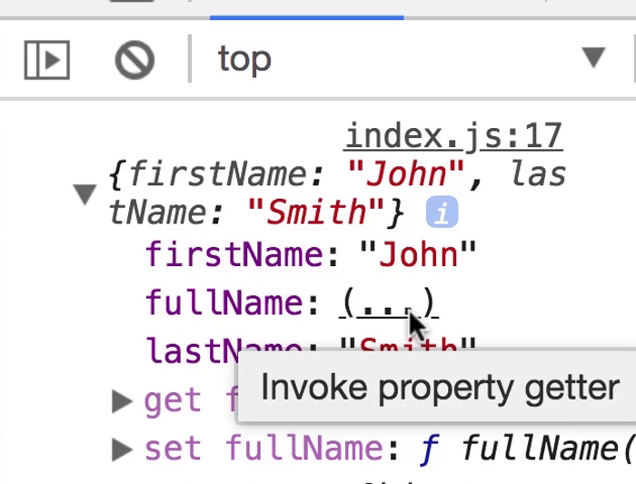

# Getters and Setters

## The problem: a full name method

Say a `person` object stores a first and last name, and several places in the code need to display the full name. Repeating the same [template literal](../objects/template-literals.md) everywhere is fragile, so it's natural to move it into a method instead:

```js
const person = {
  firstName: 'Mosh',
  lastName: 'Hamedani',
  fullName() {
    return `${person.firstName} ${person.lastName}`;
  }
};

person.fullName(); // 'Mosh Hamedani'
```

This works, but it has two rough edges:

1. `fullName` has to be **called** with `()`, even though conceptually it's just a property of the person — not an action to perform.
2. It's **read-only** — there's no way to write `person.fullName = 'John Smith'` and have that flow back into `firstName` and `lastName`.

Getters and setters solve both problems: they let a method be accessed exactly like a plain property, for both reading and writing.

## Getters: read a computed value without `()`

Prefixing a method with `get` turns it into a **getter** — accessed like a property, with no parentheses:

```js
const person = {
  firstName: 'Mosh',
  lastName: 'Hamedani',
  get fullName() {
    return `${this.firstName} ${this.lastName}`;
  }
};

person.fullName; // 'Mosh Hamedani' — no () needed
```

## Setters: write to a computed value

A `set` method is a getter's counterpart — it runs whenever something is *assigned* to that property name, receiving the assigned value as its one parameter:

```js
const person = {
  firstName: 'Mosh',
  lastName: 'Hamedani',
  get fullName() {
    return `${this.firstName} ${this.lastName}`;
  },
  set fullName(value) {
    const parts = value.split(' ');
    this.firstName = parts[0];
    this.lastName = parts[1];
  }
};

person.fullName = 'John Smith';

person.firstName; // 'John'
person.lastName;  // 'Smith'
person.fullName;  // 'John Smith'
```

A setter always takes exactly one parameter — whatever value appears on the right-hand side of the assignment (`'John Smith'` here) — and typically doesn't return anything; its job is to update other properties in response.

## Getters are evaluated lazily in the console

Logging an object with a getter doesn't run the getter immediately — browser consoles show a placeholder like `(...)` instead, and only invoke it if you click to expand it:



*Screenshot from the course video.*

This is deliberate: a getter can run arbitrary code, so the console avoids executing it just because you inspected the object — you have to ask for it explicitly.

## Related concepts

- [Types of functions](./function-types.md)
- [Template Literal](../objects/template-literals.md)
- [Basics (object literals)](../objects/basics.md)
