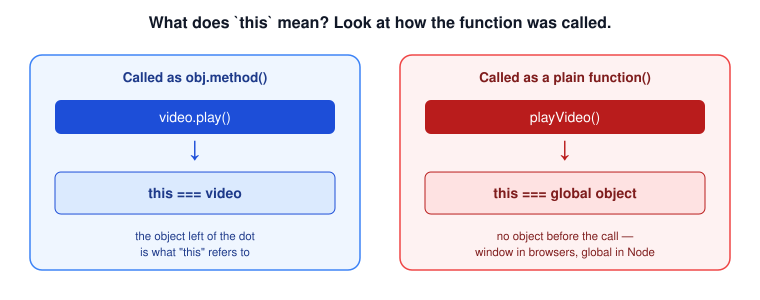
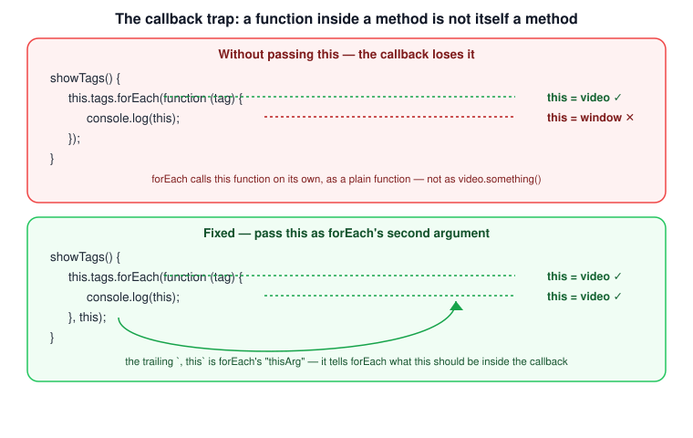

# The `this` Keyword

`this` is one of the most confusing parts of JavaScript for beginners — but the confusion almost always comes from one wrong assumption: that `this` depends on *where* a function is written. It doesn't. `this` depends entirely on *how* the function is called.

## The rule of thumb

> **`this` refers to the object that is executing the current function.**

That single sentence covers almost every case you'll run into. To apply it, ask one question about the function call: is it written as `something.doSomething()`, or just `doSomething()`?

- **Called as a method** — `video.play()` — the function is being executed *by* `video`, so `this` is `video`.
- **Called as a plain function** — `playVideo()` — there's no object executing it, so `this` falls back to the **global object**: `window` in a browser, `global` in Node.js.



*Original diagram created for this bundle.*

## Example 1: called as a method

```js
const video = {
  title: 'a',
  play() {
    console.log(this);
  }
};

video.play(); // the video object — play() is executing "on" video
```

It doesn't matter whether the method was there from the start or added later — what matters is how it's *called*:

```js
video.stop = function () {
  console.log(this);
};

video.stop(); // still the video object
```

## Example 2: called as a plain function

Take the exact same kind of function, but call it on its own, with nothing before the dot:

```js
function playVideo() {
  console.log(this);
}

playVideo(); // the global object (window in a browser, global in Node.js)
```

Same shape of function, same body — but a different call style gives a completely different `this`. This is the whole rule in action: **the call site decides `this`, not the function definition.**

## Example 3: called with `new` (constructor functions)

There's a third case: calling a function with the `new` operator. `new` builds a fresh, empty object first, and then runs the function with `this` pointing at that new object — not the global object:

```js
function Video(title) {
  this.title = title;
  console.log(this);
}

const v = new Video('b'); // a brand-new object: Video { title: 'b' }
```

Without `new`, this same `Video('b')` call would be an ordinary plain-function call, and `this` would be the global object instead — one more reason forgetting `new` on a constructor function is a classic bug.

## The callback trap

Here's where `this` catches almost everyone at least once. A function written *inside* a method is not automatically a method itself — it's still just a plain function, and the rule above applies to it independently:

```js
const video = {
  title: 'a',
  tags: ['a', 'b', 'c'],
  showTags() {
    this.tags.forEach(function (tag) {
      console.log(this); // NOT the video object!
    });
  }
};

video.showTags();
```

Inside `showTags`, `this` is `video` — it was called as `video.showTags()`, exactly as the rule predicts. But the function passed to `forEach` is called by `forEach` itself, internally, as a plain function — not as `video.something()`. So by the same rule, `this` inside *that* function is the global object, even though the code is textually nested inside a method.



*Original diagram created for this bundle.*

## Fixing it: pass `this` explicitly

Some methods that accept a callback — `forEach` is one of them — accept a second argument specifically for this: an object to use as `this` inside the callback.

```js
const video = {
  title: 'a',
  tags: ['a', 'b', 'c'],
  showTags() {
    this.tags.forEach(function (tag) {
      console.log(this); // the video object again
    }, this); // <- tell forEach what "this" should be
  }
};

video.showTags();
```

At the point `this` is passed as the second argument, execution is still inside `showTags`, so `this` there is still `video` — that's the value being forwarded into the callback. Not every method that takes a callback offers this second argument, though, which is why [`call`, `apply`, and `bind`](./call-apply-bind.md) exist: they give you a way to control `this` for *any* function call, not just the ones with a built-in `thisArg` parameter.

## An even simpler fix: arrow functions

[Arrow functions](./arrow-functions.md) sidestep this whole problem, because they don't get their own `this` at all — they simply use whatever `this` already was in the surrounding code:

```js
showTags() {
  this.tags.forEach(tag => {
    console.log(this); // the video object — no thisArg needed
  });
}
```

Since the rule "a function's `this` comes from its own call" never applies to arrow functions in the first place, there's no trap to fall into. This is why arrow functions are the go-to choice for callbacks today, and `thisArg` parameters and `bind` are mostly seen in older code.

## Quick recap

| How the function is called | What `this` is |
| --- | --- |
| `obj.method()` | `obj` |
| `someFunction()` | the global object (`window` / `global`) |
| `new SomeFunction()` | a brand-new, empty object |
| A plain callback passed into another function | the global object — *unless* something explicitly sets it otherwise |

## Related concepts

- [call, apply, and bind](./call-apply-bind.md)
- [Constructor Functions](../objects/constructor-functions.md)
- [Arrow Functions](./arrow-functions.md)
- [Functions are Objects](../objects/functions-are-objects.md)
