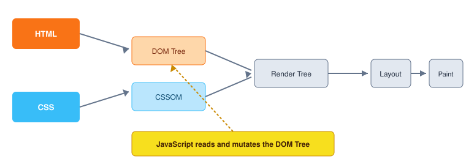

# JavaScript in Browsers

Web browsers were the original host environment for JavaScript. In a browser, JavaScript turns static HTML and CSS documents into interactive, responsive user experiences.

## How browsers run JavaScript

A web browser consists of two main processing engines:
1. **Rendering engine**: Parses HTML and CSS to construct the Document Object Model (DOM) and the CSS Object Model (CSSOM), combining them to paint pixels on the screen.
2. **JavaScript engine**: Parses, compiles, and executes JavaScript code (e.g., Google Chrome uses V8, Mozilla Firefox uses SpiderMonkey, Apple Safari uses JavaScriptCore).



The browser provides web-specific APIs that JavaScript can access through the global `window` object:
- **DOM (Document Object Model)**: Inspect and mutate page elements (`document.querySelector`, `element.textContent`).
- **BOM (Browser Object Model)**: Access browser features outside the document (`window.location`, `window.navigator`, `window.history`).
- **Web APIs**: `fetch` for HTTP requests, `localStorage` for client-side storage, `setTimeout` for timers.

## Including JavaScript in HTML

JavaScript is loaded into HTML using the `<script>` tag.

### 1. Inline scripts

Code written directly between opening and closing `<script>` tags:

```html
<button id="btn">Click me</button>

<script>
  const btn = document.getElementById('btn');
  btn.addEventListener('click', () => {
    alert('Button clicked!');
  });
</script>
```

Inline scripts are quick for prototypes, but mixing script logic inside markup quickly becomes hard to maintain.

### 2. External script files

Linking to a standalone `.js` file via the `src` attribute:

```html
<script src="./app.js"></script>
```

External scripts encourage clean separation of concerns and enable browser caching.

## Script placement and execution timing

By default, when a browser encounters a `<script>` tag while parsing HTML, it pauses HTML parsing, downloads the script (if external), and executes it immediately.

### Script at the bottom of `<body>`

Placing `<script src="./app.js"></script>` right before the closing `</body>` tag ensures all DOM elements above it have already been parsed:

```html
<!doctype html>
<html lang="en">
  <head>
    <meta charset="utf-8">
    <title>Browser Demo</title>
  </head>
  <body>
    <h1 id="heading">Hello World</h1>

    <!-- Script at the end of body -->
    <script src="./app.js"></script>
  </body>
</html>
```

### `defer` vs `async` attributes

When placing script tags in `<head>`, use `defer` or `async` to prevent blocking HTML parsing:

```html
<!-- defer: downloads in background, executes after HTML parsing completes, preserves order -->
<script src="./app.js" defer></script>

<!-- async: downloads in background, executes as soon as downloaded (unordered) -->
<script src="./analytics.js" async></script>
```

- **`defer` (recommended for app scripts)**: Downloads script files in parallel with HTML parsing, but delays execution until the full document is parsed. Scripts execute in the exact order they appear in the HTML.
- **`async` (best for independent third-party scripts)**: Downloads in parallel and executes immediately once downloaded, regardless of DOM readiness or script order.

## Browser developer tools

Modern browsers provide built-in Developer Tools (F12 or Ctrl+Shift+I / Cmd+Option+I):
- **Console tab**: Execute interactive JavaScript snippets, inspect objects, and view log messages (`console.log()`, `console.warn()`, `console.error()`).
- **Elements/Inspector tab**: View the live DOM tree and CSS styles.
- **Sources/Debugger tab**: Set breakpoints, step through code line-by-line, and inspect variable values at runtime.

## Related concepts

- [What is JavaScript](./what-is-javascript.md)
- [Separation of Concerns](./separation-of-concerns.md)
- [Setting up the Development Environment](./setting-up-the-development-environment.md)
- [JavaScript in Node](./javascript-in-node.md)

*This draft was generated from MDN Web Docs standards and requires human review before promotion to stable.*
