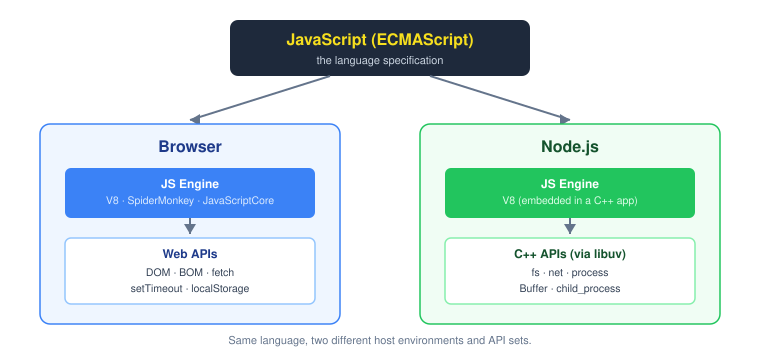

# What is JavaScript


JavaScript is one of the most popular and widely used programming languages in the world. It powers the interactive web, back-end servers, mobile applications, and command-line tools.

## 1. What is JavaScript?

JavaScript is a high-level programming language that makes applications dynamic and interactive.

- **Fastest growing language**: Consistently ranks at the top of developer surveys (such as Stack Overflow's most popular technologies).
- **Enterprise adoption**: Companies such as Netflix, Walmart, and PayPal build entire platforms and backend services around JavaScript.
- **Career paths**: Learning JavaScript opens doors to several high-demand engineering roles:
  - **Front-end Developer**: Focuses on browser user interfaces and client-side logic.
  - **Back-end Developer**: Builds APIs, databases, and server-side services using runtimes like Node.js.
  - **Full-stack Developer**: Works across both front-end and back-end layers.

## 2. What can you do with JavaScript?

Historically, JavaScript was treated primarily as a client-side scripting language for web pages (sometimes dismissed as a "toy language"). Today, supported by large communities and major technology investments from companies like Google and Meta, JavaScript is used to build:

- **Web and mobile applications**: Rich web applications and cross-platform native mobile apps.
- **Real-time networking services**: Fast, event-driven backends such as chat systems and video streaming services.
- **Command-line tools (CLI)**: Developer automation, build tooling, and system utilities.
- **Games**: Interactive 2D and 3D browser games (e.g., using WebGL engines like PlayCanvas).

## 3. Where does JavaScript code run?

JavaScript was originally designed to execute exclusively inside web browsers.

### Browser engines

Every web browser contains a specialized program called a **JavaScript engine** that parses and executes JavaScript code:
- **Google Chrome**: V8
- **Mozilla Firefox**: SpiderMonkey
- **Apple Safari**: JavaScriptCore

### Running outside the browser with Node.js

In 2009, engineer Ryan Dahl took Google Chrome's open-source **V8** engine and embedded it inside a C++ application, naming it **Node** (Node.js).



Node allows JavaScript to run directly on an operating system outside a browser. This enables developers to use JavaScript for server-side APIs, file operations, and backend services.

Both browsers and Node.js provide a **runtime environment** for JavaScript code, each supplying environment-specific APIs (browsers supply the DOM and `window`; Node supplies filesystem and process APIs).

## 4. JavaScript vs. ECMAScript

The terms JavaScript and ECMAScript are closely related, but have distinct definitions:

- **ECMAScript**: The **specification** and standardized language definition maintained by Ecma International (specifically Technical Committee 39 / TC39).
- **JavaScript**: A **programming language** that conforms to and implements the ECMAScript specification.

### Standards timeline

- **1997**: First version of ECMAScript (ES1) published.
- **2015 (ES6 / ES2015)**: Major overhaul introducing classes, modules, arrow functions, `let`/`const`, promises, and template literals.
- **Annual releases (2016+)**: TC39 shifted to yearly updates (ES2016, ES2017, etc.) to introduce new capabilities progressively.

## Quick hands-on: Running code in Chrome DevTools

You can immediately experiment with JavaScript in any browser without installing local developer tools:

1. Open Google Chrome.
2. Right-click anywhere on the page and select **Inspect** (or press `F12` / `Ctrl+Shift+I`).
3. Select the **Console** tab.
4. Type code directly into the console prompt:

```js
console.log('Hello World');
// Output: Hello World
// Evaluates to: undefined

2 + 2;
// Evaluates to: 4

alert('Hello from JavaScript!');
// Displays a browser alert dialog
```

## Related concepts

- [Setting up the Development Environment](./setting-up-the-development-environment.md)
- [JavaScript in Browsers](./javascript-in-browsers.md)
- [Separation of Concerns](./separation-of-concerns.md)
- [JavaScript in Node](./javascript-in-node.md)
- [Variables and declarations](../basics/variables.md)

