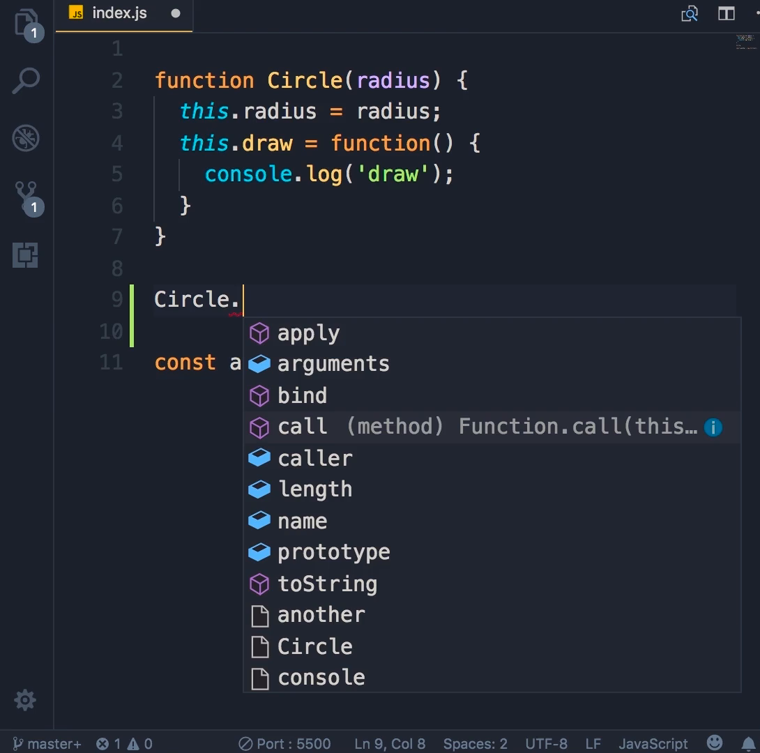

# Functions are Objects

One of the more confusing ideas in JavaScript is that functions are themselves objects. Take this constructor function:

```js
function Circle(radius) {
  this.radius = radius;
  this.draw = function () {
    console.log('draw');
  };
}
```

`Circle` isn't just a block of code you can call — it's an object with its own properties and methods, the same way any object literal is.



*Screenshot from the course video.* The purple icons are **methods** (`apply`, `bind`, `call`, `toString`), and the blue icons are **properties** (`arguments`, `caller`, `length`, `name`, `prototype`).

## Built-in properties

Two of the most commonly used ones:

```js
Circle.name;   // 'Circle' — the function's name
Circle.length; // 1 — the number of declared parameters
```

## Every function is built by the `Function` constructor

An earlier concept, [Constructor Property](./constructor-property.md), showed that every object has a `constructor` property pointing to the function that created it. Functions are no exception:

```js
Circle.constructor; // ƒ Function() { [native code] }
```

When the JavaScript engine sees a function declaration, it uses this built-in `Function` constructor behind the scenes. You can prove it by building the exact same function manually, passing the parameter names and the body as strings:

```js
const Circle1 = new Function(
  'radius',
  `
  this.radius = radius;
  this.draw = function () {
    console.log('draw');
  }
`
);

const circle = new Circle1(1);
console.log(circle); // {radius: 1, draw: f}
```

`circle` comes out identical to an instance created from the `function Circle(radius) { ... }` declaration — because that's what the declaration compiles down to.

## `call()` and `apply()`

Because a function is an object, it comes with methods for invoking it directly, without `new`. Both `call` and `apply` take the object to use as `this` as their first argument:

```js
Circle.call({}, 1);      // arguments passed individually
Circle.apply({}, [1]);   // arguments passed as an array

Circle.apply({}, [1, 2, 3]); // apply is handy when the arguments already live in an array
```

`call` and `apply` do the same thing — the only difference is how the remaining arguments are supplied: one by one for `call`, or bundled into an array for `apply`.

This is also what the `new` operator is doing under the hood. `new Circle(1)` is roughly equivalent to `Circle.call({}, 1)`: `new` creates a fresh empty object and calls `Circle` with `this` bound to it. Skip `new` and call `Circle(1)` directly, and `this` falls back to the global object (`window` in browsers) instead of a new object — which is why forgetting `new` on a constructor function is a classic source of bugs.

## Attaching your own properties

You can also attach custom properties directly to a function object, since it's just an object under the hood:

```js
Circle.callCount = 0;
```

## Related concepts

- [Constructor Functions](./constructor-functions.md)
- [Constructor Property](./constructor-property.md)
- [Value vs Reference Types](./value-vs-reference-types.md)
