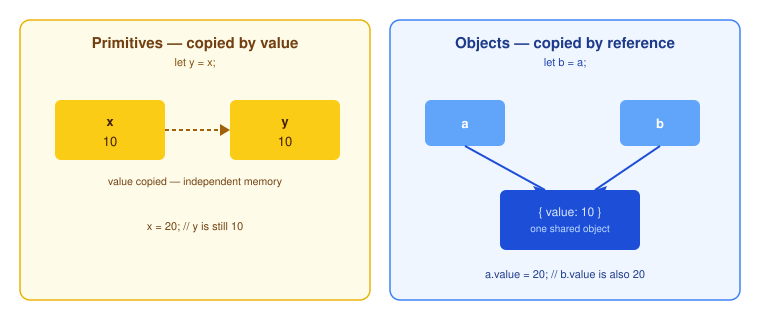

# Value vs Reference Types

JavaScript types fall into two categories that behave differently when copied or compared.



## Value types (primitives)

`Number`, `String`, `Boolean`, `Symbol`, `BigInt`, `undefined`, and `null` are copied **by value**. Assigning one variable to another copies the value itself:

```js
let x = 10;
let y = x;

x = 20;
console.log(y); // 10 (unaffected)
```

## Reference types (objects)

Objects, arrays, and functions are copied **by reference**. Assigning one variable to another copies a reference to the same underlying object, not the object itself:

```js
let a = { value: 10 };
let b = a;

a.value = 20;
console.log(b.value); // 20 (same object)
```

## Passing to functions

The same rule applies to function arguments: primitives are passed by value (the function gets its own copy), while objects are passed by reference (the function can mutate the caller's object):

```js
function increase(number) {
  number++;
}
let counter = 10;
increase(counter);
console.log(counter); // 10

function mutate(obj) {
  obj.value++;
}
let point = { value: 10 };
mutate(point);
console.log(point.value); // 11
```

## Related concepts

- [Basics](./basics.md)
- [Dynamic Nature of Objects](./dynamic-nature-of-objects.md)
- [Cloning an Object](./cloning-an-object.md)
